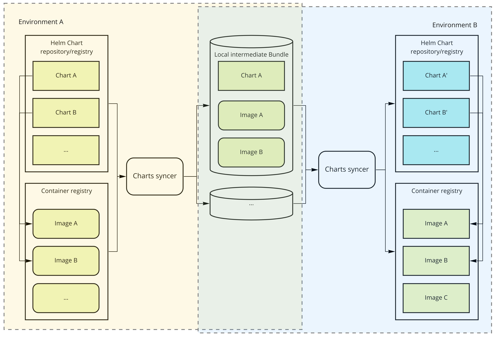

# Air gap scenario

In some situations you may want to sync two Helm chart repositories without direct connectivity between them. 
charts-syncer support this scenario via intermediate Chart Bundles.

An intermediate Chart Bundle is just a tarball containing the original Helm Chart code plus its associated container images.

This intermediate Chart Bundle enables a two-step process where its content will be used to relocate the container images 
and the rewritten Helm Chart without contacting the source Container images registry or Helm repository. 
Making the relocation process suitable for disconnected, air-gap target environments

As you can see in the diagram below, the intermediate bundles are the only bits that ever live in both the source and target environments.
The environment A (source) does not know about the final location (environment B) of the Charts/Container images and the other way around.



## Prerequisites

Only Helm Charts that include a valid `.relok8s-images.yaml` are compatible with the two steps relocation described here.
For more information about this file please refer to [asset-relocation-tool-for-kubernetes readme](https://github.com/vmware-tanzu/asset-relocation-tool-for-kubernetes#image-hints-file).

## Relocation process

An outline of the process looks like

1. Run charts-syncer to import the desired Helm Charts into local the intermediate bundles
2. Manually move the previously generated intermediate bundles to the target environment
3. Run charts-syncer (for a second time) but this time using the intermediate bundles as source

### Step 1: Save Chart Bundles

In this first step charts-syncer needs access to the source charts repository and container images registry

Create a config file like the following and save it to `config-save-bundles.yaml`

```yaml
source:
  repo:
#   auth:    # Include auth if credentials for the registry are required.  Alternatively you can use environmental variables
#     username: [USERNAME]
#     password: [PASSWORD]  
    kind: HELM # or as any other supported Helm Chart repository kinds
    url: https://charts.trials.tac.bitnami.com/demo
# containers:
#   auth:
#    registry: [URL]  # Do not include "https://" or trailing project and directory.  Eg. only include domain --> registry.pivotal.io
#    username: [USERNAME]
#    password: [PASSWORD]    
target:
  # The important bit. This instructs charts-syncer to store intermediate bundles in the given directory
  intermediateBundlesPath: /tmp/chart-bundles-dir
```

Execute charts-syncer as follows:

```bash
charts-syncer sync --config ./config-save-bundles.yaml
```

Once charts-syncer finishes preparing the bundles you will see them in the directory set in the `intermediateBundlesPath`
configuration property.

The directory will contain an intermediate Chart Bundle for every imported Helm Chart.
> :warning: IMPORTANT: The content of the bundle is not meant to be used directly but instead as the input for the step 2 of the process.

### Step 2: Move Chart Bundles

Use your method of choice to move all the Chart Bundles from the machine with access to the source repo to the machine with access to the target repo.

### Step 3: Load Chart Bundles

In this final step charts-syncer needs access to the target charts repository and container images registry.
The tool will iterate over each of the Chart Bundle re-tagging the container images and pushing them to the final container registry.
Additionally, it will re-write the chart code to pull the images from the target container registry.

Create a config file like the following and save it to `config-load-bundles.yaml`

```yaml
# Note how the source this time is the directory containing the bundles
source:
  intermediateBundlesPath: /tmp/chart-bundles-dir
target:
  containerRegistry: my.harbor.io
  containerRepository: my-project/containers
  repo:
    kind: OCI # or as any other supported Helm Chart repository kinds
    url: https://my.harbor.io/my-project/subpath
 #  auth:
 #    username: [USERNAME]
 #    password: [PASSWORD]
```

Execute charts-syncer as usual:

```bash
charts-syncer sync --config ./config-load-bundles.yaml
```

Once charts-syncer finishes all your charts and images should be pushed to the configured chart repository and container registry.
