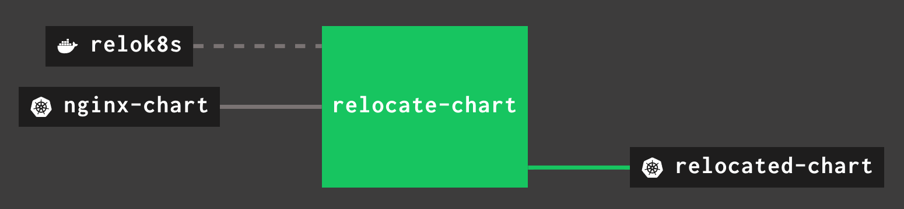

# Concourse Pipeline

This example is a [Concourse]() pipeline file that shows how to use the Asset Relocation Tool for Kubernetes to automatically relocate a Helm chart.



## Resources

### Asset Relocation Tool for Kubernetes

The pipeline loads the container-image that contains `relok8s`, the CLI for the Asset Relocation Tool for Kubernetes:

```yaml
resources:
  - name: relok8s
    type: registry-image
    icon: docker
    source:
      repository: projects.registry.vmware.com/tanzu_isv_engineering/relok8s
```

### Helm Charts

The pipeline also loads a Helm chart, using the [Helm Chart resource](https://github.com/jghiloni/helm-chart-resource)
(In this example, the [Bitnami Nginx](https://bitnami.com/stack/nginx/helm) chart),
and it finally stores the relocated chart into a Harbor registry.

```yaml
resource_types:
  - name: helm-chart
    type: registry-image
    source:
      repository: jghiloni/helm-chart-resource
      tag: v0.1.1
      username: ((dockerhub.username))
      password: ((dockerhub.access_token))

resources:
  - name: nginx-chart
    type: helm-chart
    icon: kubernetes
    source:
      repository_url: https://charts.bitnami.com/bitnami
      chart: nginx

  - name: relocated-chart
    type: helm-chart
    icon: kubernetes
    source:
      repository_url: https://harbor-repo.vmware.com/chartrepo/tanzu_isv_engineering_private
      username: ((harbor-private.username))
      password: ((harbor-private.token))
      chart: nginx
```

## Jobs

This pipeline has a single job with three tasks.

### make-image-hints-file

This task builds the image hints file that is a required input for `relok8s`.
In a production setting, this would either be replaced with a `git` resource or by using a Helm chart with an embedded image hints file.

```yaml
      - task: make-image-hints-file
        image: relok8s
        config:
          platform: linux
          outputs:
            - name: nginx-chart-hints
          run:
            path: bash
            args:
              - -exc
              - |
                cat > nginx-chart-hints/image-hints.yaml <<EOF
                ---
                - "{{ .image.registry }}/{{ .image.repository }}:{{ .image.tag }}"
                - "{{ .cloneStaticSiteFromGit.image.registry }}/{{ .cloneStaticSiteFromGit.image.repository }}:{{ .cloneStaticSiteFromGit.image.tag }}"
                - "{{ .ldapDaemon.image.registry }}/{{ .ldapDaemon.image.repository }}:{{ .ldapDaemon.image.tag }}"
                - "{{ .metrics.image.registry }}/{{ .metrics.image.repository }}:{{ .metrics.image.tag }}"
                EOF
```

### relocate

This task is the one that invokes `relok8s`, which outputs the modified Helm chart:
The `docker-login.sh` script is used to set the credentials for the private image registry.

```yaml
      - task: relocate
        image: relok8s
        config:
          platform: linux
          params:
            REGISTRY_SERVER: harbor-repo.vmware.com
            REGISTRY_USERNAME: ((harbor-private.username))
            REGISTRY_PASSWORD: ((harbor-private.token))
          inputs:
            - name: nginx-chart
            - name: nginx-chart-hints
          outputs:
            - name: rewritten-chart
          run:
            path: bash
            args:
              - -exc
              - |
                docker-login.sh "${REGISTRY_SERVER}" "${REGISTRY_USERNAME}" "${REGISTRY_PASSWORD}"

                relok8s chart move nginx-chart/*.tgz \
                  --yes \
                  --image-patterns nginx-chart-hints/image-hints.yaml \
                  --registry "${REGISTRY_SERVER}" \
                  --repo-prefix tanzu_isv_engineering_private
                mv *.relocated.tgz rewritten-chart/chart.tgz
```

### print-diff

This task shows exactly what was modified inside the Helm chart.
This it to illustrate the work that `relok8s` did.
In a production setting, this task would not be necessary, but would likely be replaced with a task to deploy the chart, or to store it in a chart repository.

```yaml
      - task: print-diff
        image: relok8s
        config:
          platform: linux
          inputs:
            - name: nginx-chart
            - name: rewritten-chart
          run:
            path: bash
            args:
              - -exc
              - |
                # NOTE: The leading ! is because it is an error condition if there are no differences in the two files
                ! diff --context=3 \
                  <(tar xzfO nginx-chart/*.tgz nginx/values.yaml) \
                  <(tar xzfO rewritten-chart/chart.tgz nginx/values.yaml)
```

### put

Finally, the relocated chart is pushed to the Harbor registry

```yaml
      - put: relocated-chart
        inputs: detect
        params:
          repository: rewritten-chart/chart.tgz
```